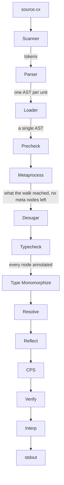

The order lives in `lib/compile.ml`, from `Desugar` on, and in `lib/pipeline.ml` for the surface-syntax part before it. `Metaprocess` cannot reach `Pipeline` because it is what runs a meta block, so the split is where the recursion is cut.

## Phases

### Scanner

Source text to tokens. Every span a diagnostic is reported against — a file and a byte range into it — is fixed here and carried by every tree that follows. See [Diagnostics.md](Diagnostics.md).

### Parser

Tokens to the surface AST: the program as written, including the `meta`, `gen`, `code` and `import` nodes no later stage sees. Nothing is resolved. A name is a string, and a type annotation is syntax rather than a type.

### Loader

Several files become one program. A unit contributes declarations and only the entry contributes statements — an imported file's top-level statements run only when it is itself the entry — so nothing is initialized in an order and an import cycle is harmless. A module's top-level `meta` blocks and `derive`s count as declarations, marked to wait until the walk first asks that module for a name. Names are made unique per unit here, which is why nothing after this point knows that modules exist. See [Modules.md](Modules.md).

### Precheck

The whole loaded program checked once before metaprocessing, reached or not, on a copy with meta erased: a static value parameter becomes a local of its declared type, a function that held a `meta` block returns an unknown value, `code(…)` is unknown, and `meta` and `gen` are dropped. It runs `Typecheck` under the `partial` policy, so a name, type, trait, member or impl nothing has declared yet is unknown rather than an error — a meta block may still declare it. Its errors are merged with the full check's after the walk, duplicates dropped, which is how an error in code the walk never reaches is still reported. See [Type System.md](Type%20System.md).

### Metaprocess

A walk from the roots — the entry's top-level statements, or under `cx test` the tests — in source order. A declaration is metaprocessed the first time the walk reaches it, once, and only what the running program reaches is emitted. Each `meta` block is compiled and run where the walk meets it, then removed — this pass is the rest of the pipeline applied to a fragment of the program it belongs to — and what its `gen` emitted is walked in place as ordinary source. A template taking a static *value*, or holding a `meta` block, is instantiated here, when a call to it is reached, memoized by name and static arguments across the whole program; a value can decide a type, so there is no single type to check the template against until one is substituted. It has to run on surface syntax: `code` captures a statement as written, and anything generated after `Desugar` would never be lowered. See [Metaprocessing.md](Metaprocessing.md) and [Meta Scope and Instantiation.md](Meta%20Scope%20and%20Instantiation.md).

### Desugar

Rewrites the surface control forms into the smaller set later passes handle — `for (x in xs)` becomes a `while` over an index, a C-style `for` becomes an initializer and a `while`, a variadic call collects its trailing arguments into an array. The prelude is prepended here, so library code takes exactly the same path as the program.

### Typecheck

Hindley-Milner inference with effect rows over what the walk emitted, under the `strict` policy, producing a tree in which every node carries its type. It is the only pass that reports more than one error, so a program with two unrelated mistakes says both; every other pass stops at the first.

### Type Monomorphize

Copies a generic body per concrete type its call sites use, because an operator or method inside it cannot be selected while the type is still a variable. What it copies takes only types — written `<T>` parameters, and the implicit ones inference gives an unannotated parameter — and holds no `meta` block; any other template was already instantiated by the walk. Only bodies holding something type-directed are copied; one that merely moves values around keeps a single copy and stays generic.

A trait type is concrete here, so a body taking a trait object is copied once and shared by every implementer — which is the whole point of having asked for one.

### Resolve

Turns every construct whose meaning depended on a type into a primitive or a call — operators, compound assignment, indexing, collection literals, method calls. It also flattens every `impl` into ordinary functions, so nothing downstream knows that methods or operators exist.

A coercion to a trait type becomes the value beside a table of the functions that trait's methods flattened to, and a method call on a trait-typed receiver becomes a call through that table. The table is built here because this is where the set of concrete types is final and every impl is already in hand.

### Reflect

Folds each question asked of a type into the answer it names, and erases itself. It runs after checking because that is when the annotation it reads exists, and before evaluation so the interpreter never sees a `Type`.

### CPS

Rewrites the functions that perform control effects, choosing per effect between two translations: evidence passing when every handler resumes in tail position, full continuations otherwise.

### Verify

Checks each node against its children — including that every slot of a trait object can take the data it was built beside, and that a call through one has an object to read its target from. A pass that constructs nodes invents their annotations rather than getting them from inference, and a wrong one is silent — `CPS` decides what to convert by reading the effect row off a call's annotation, so a synthesized call carrying an empty row is skipped and the program performs an unhandled effect at runtime with no compiler error anywhere.

### Interp

Walks the converted tree. It is also the evaluator `Metaprocess` runs a meta block with, which is what makes the recursion real: there is no second pipeline and no compile-time subset of the language.